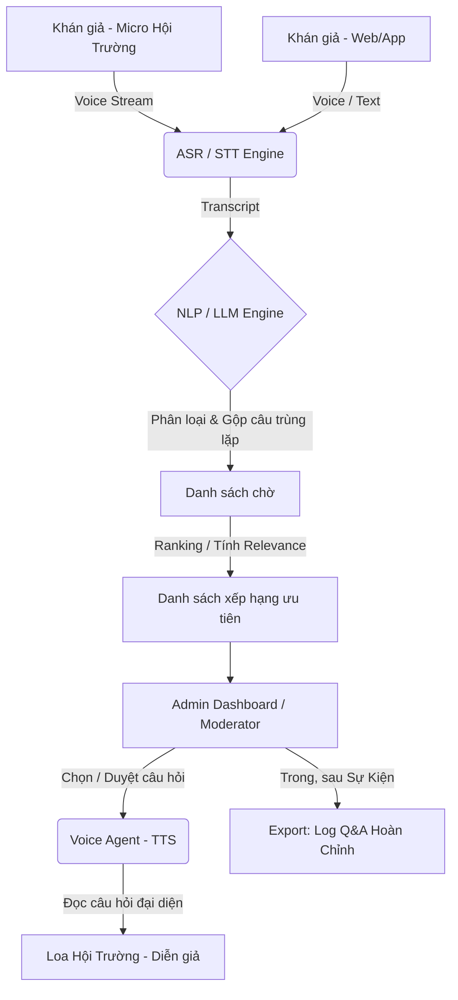
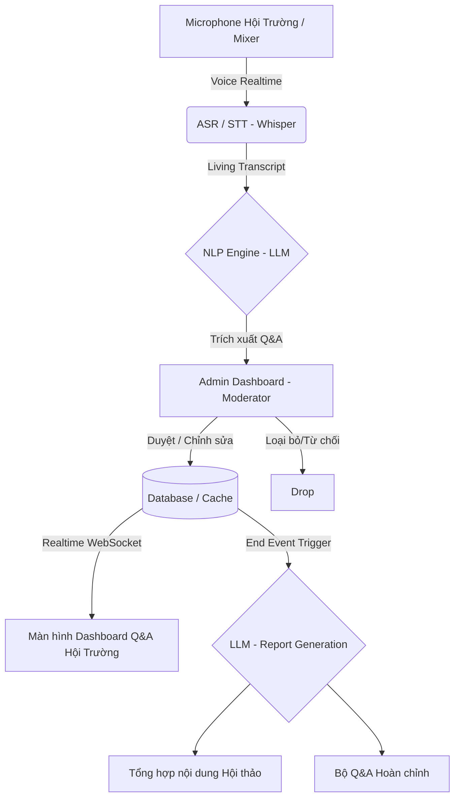
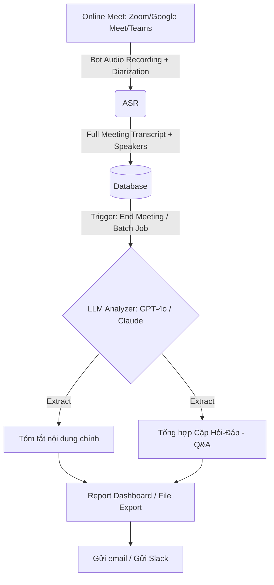
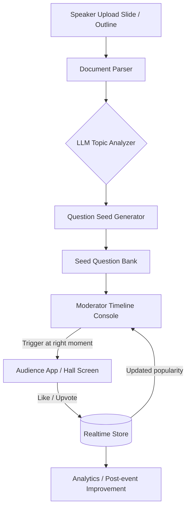

# Use Cases: Hệ thống AI Q&A Moderator

Tài liệu này trình bày Use Case tổng quát và chi tiết cho 4 bài toán ứng dụng AI trong quản lý hỏi đáp (Q&A) tại các sự kiện offline và online.

---

## Use Case Tổng Quát

**Mục tiêu:** Cải thiện và tối ưu hóa luồng giao tiếp giữa Khán giả và Diễn giả/Ban tổ chức bằng cách sử dụng các công nghệ AI (Speech-to-Text - ASR, Xử lý ngôn ngữ tự nhiên - NLP/LLM, và Text-to-Speech - TTS).
**Giá trị cốt lõi:**
- Theo dõi thông tin thời gian thực bằng văn bản thay vì chỉ nghe bằng tai.
- Kiểm duyệt nội dung câu hỏi để đảm bảo chất lượng sự kiện.
- Tự động hóa quá trình tổng hợp và lưu trữ kiến thức (Q&A/Meeting Minutes) trong và sau sự kiện.
- Chủ động kích hoạt tương tác bằng các câu hỏi mồi được AI sinh ra từ nội dung bài thuyết trình.

---

## Bài toán 1: Voice Agent Moderator (Quản lý Q&A Hội Thảo)

### Bối cảnh
Phần Q&A tại hội thảo/seminar thường hỗn loạn: khán giả tranh nhau hỏi, moderator bỏ sót người giơ tay, các câu hỏi bị trùng lặp nhiều lần và không có bản ghi lưu lại. Time management kém khiến diễn giả (speaker) không thể trả lời hết.

### Use Case
1. **Ghi nhận đồng thời:** Khán giả đặt câu hỏi thông qua việc nói vào micro (ở hội trường) hoặc gửi text, voice qua App/Web.
2. **Chuyển đổi văn bản (ASR):** Hệ thống phản hồi, tự động chuyển đổi mọi nguồn giọng nói thành văn bản (Dịch văn bản sang tiếng diễn giả yêu cầu).
3. **Phân loại & Gộp (Clustering):** Mô hình NLP/LLM tiến hành phân loại và tự động gộp các câu hỏi trùng lặp ý tứ lại với nhau thành một câu tổng hợp đại diện.
4. **Xếp hàng ưu tiên (Ranking):** Các câu hỏi được đánh giá relevance (độ liên quan) và thiết lập priority xếp hạng chờ duyệt trên giao diện quản lý.
5. **Đọc cho Diễn giả (TTS):** Ban tổ chức chọn/duyệt câu hỏi tốt nhất. Sau đó, Voice Agent Moderator (Hệ thống TTS) sẽ đọc to câu hỏi tổng hợp đó lên hệ thống loa cho diễn giả trả lời.
6. **Lưu trữ (Q&A Log):** Thu thập toàn bộ để xuất nội dung hội thảo, bản log Q&A hoàn chỉnh làm tư liệu tham khảo sau sự kiện cho Ban tổ chức.

### Architecture Diagram

---

## Bài toán 2: Hội thảo Offline - Dashboard Q&A Có Kiểm Duyệt & Tổng Hợp

### Bối cảnh
Hội trường có khán giả và diễn giả trao đổi trực tiếp qua micro. Không có hệ thống nhập câu hỏi bằng tay. Ban tổ chức muốn có một màn hình lớn hiển thị realtime các câu hỏi và câu trả lời đang diễn ra (có qua kiểm duyệt), đồng thời tổng hợp lại nội dung thảo luận và bộ Q&A lưu trữ sau khi sự kiện kết thúc.

### Use Case
1. **Thu âm:** Một máy tính (cắm vào amply/mixer của hội trường) thu lại toàn bộ âm thanh (voice realtime).
2. **Chuyển đổi văn bản (ASR):** Audio stream được gửi liên tục đến mô hình STT (Whisper) để tạo bản ghi văn bản (transcript).
3. **Trích xuất thông tin (NLP):** Mô hình LLM phân tích transcript realtime để nhận diện đâu là câu hỏi của khán giả và đâu là câu trả lời của diễn giả.
4. **Kiểm duyệt (Moderation):** Thông tin trích xuất được đưa lên Admin Dashboard. Moderator (người dùng thật) sẽ kiểm tra, chỉnh sửa (nếu có sai sót do nhận diện) và duyệt nội dung.
5. **Hiển thị (Dashboard):** Dữ liệu Q&A đã được duyệt đẩy qua WebSocket lên màn hình Dashboard lớn của hội trường.
6. **Tổng hợp (Post-event):** Sau khi sự kiện kết thúc, hệ thống LLM tổng hợp lại các nội dung chính của buổi hội thảo và xuất toàn bộ bộ câu hỏi/đáp án (Q&A) đã diễn ra.

### Architecture Diagram

---

## Bài toán 3: Họp Online (Meet/Zoom) - Tổng hợp Q&A Cuối Buổi

### Bối cảnh
Cuộc họp online nội bộ hoặc với khách hàng diễn ra trên các nền tảng như Google Meet, Zoom. Mọi người trao đổi liên tục nhưng việc ghi chép lại meeting minutes và tổng hợp Q&A bị thiếu sót hoặc tốn quá nhiều thời gian của thư ký.

### Use Case
1. **Thu thập dữ liệu:** Một Bot tham gia cuộc họp (hoặc Audio Loopback) thu lại toàn bộ âm thanh và tự động bóc tách giọng nói thành văn bản kèm tên người nói (Speaker Diarization).
2. **Lưu trữ:** Toàn bộ lịch sử trao đổi được lưu vào cơ sở dữ liệu.
3. **Phân tích (Batch Processing):** Khi cuộc họp kết thúc, người dùng bấm nút "Tổng hợp". Mô hình LLM đọc toàn bộ transcript:
   - Tóm tắt những ý chính của buổi họp.
   - Nhặt ra chính xác từng cặp Câu hỏi - Câu trả lời (Bộ Q&A).
4. **Xuất báo cáo:** Hệ thống tạo ra một tài liệu Q&A & Meeting Minutes hoàn chỉnh và gửi tới Email/Workspace của nhóm.

### Architecture Diagram

---

## Bài toán 4: Speaker Copilot - AI Sinh Câu Hỏi Mồi Từ Slide Deck

### Bối cảnh
Nhiều buổi thuyết trình có nội dung tốt nhưng phần tương tác với khán giả diễn ra chậm vì khán giả chưa kịp nghĩ ra câu hỏi hoặc ngại mở đầu. Diễn giả và moderator muốn có sẵn một bộ câu hỏi mồi bám sát bài thuyết trình, được AI gợi ý theo nhiều mức độ từ phổ biến đến chuyên sâu, và được tung ra đúng thời điểm để kích thích thảo luận.

### Use Case
1. **Upload nội dung:** Trước sự kiện, diễn giả tải lên slide deck, transcript note hoặc outline bài nói.
2. **Phân tích tài liệu:** Hệ thống dùng LLM đọc nội dung và trích xuất chủ đề chính, khái niệm quan trọng, luận điểm dễ gây tranh luận, và các phần dễ cần làm rõ.
3. **Sinh câu hỏi mồi:** AI tạo một bộ câu hỏi theo nhiều mức độ:
   - Câu hỏi phổ biến / khởi động.
   - Câu hỏi làm rõ khái niệm.
   - Câu hỏi áp dụng thực tế.
   - Câu hỏi phản biện / phân tích chuyên sâu.
4. **Gắn theo timeline:** Mỗi câu hỏi được map với phần nội dung hoặc thời điểm phù hợp trong bài thuyết trình để moderator có thể tung ra đúng lúc.
5. **Đưa ra trước khán giả:** Trong buổi nói, hệ thống hiển thị câu hỏi mồi trên app/dashboard hoặc để moderator bấm kích hoạt.
6. **Audience feedback:** Khán giả có thể like/upvote câu hỏi để thể hiện mức quan tâm hoặc mong muốn được diễn giả trả lời.
7. **Đồng bộ ưu tiên:** Số lượt like được cập nhật realtime để moderator biết câu nào nên đưa lên ưu tiên trả lời.
8. **Hậu kiểm:** Sau sự kiện, hệ thống lưu lại hiệu quả của từng câu hỏi mồi để cải thiện prompt và chọn chiến lược hỏi tốt hơn cho các buổi sau.

### Architecture Diagram

