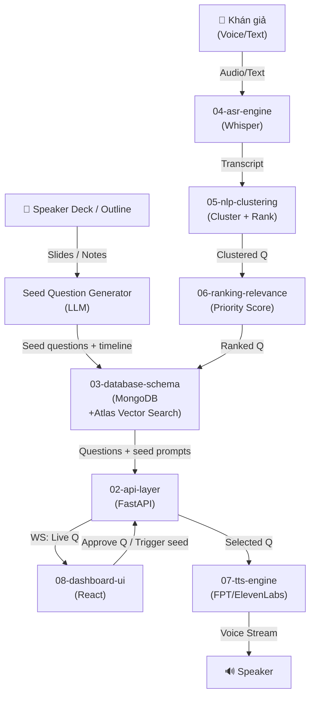

# 00-architecture-overview

Hệ thống Q&A thời gian thực cho hội thảo offline/online. Hệ thống nhận input từ voice/text của khán giả, tự động phân loại & xếp hạng câu hỏi trùng lặp, sau đó cho moderator duyệt và đọc qua loa. Ngoài ra, diễn giả có thể upload nội dung bài thuyết trình để AI sinh câu hỏi mồi theo timeline và thu thập lượt quan tâm của khán giả theo thời gian thực. Mục tiêu: giảm hỗn loạn, tăng chất lượng Q&A, và chủ động kích hoạt tương tác.

## System Diagram

## 1. Core Layers

| Layer | Technology | Responsibility |
|-------|-----------|-----------------|
| **Input** | Whisper STT | Real-time voice→text conversion (<2s latency) |
| **Processing** | FastAPI + LLM | Receive transcripts, cluster, rank questions |
| **Engagement** | LLM + Realtime feedback | Generate seed questions from deck and capture likes/upvotes |
| **Storage** | MongoDB | Persist questions, metadata, logs in flexible documents |
| **Realtime** | WebSocket | Push Q&A updates to dashboard live |
| **Output** | TTS API | Convert approved questions to speech |
| **UI** | React + Tailwind | Moderator dashboard for approval & control |

## 2. Tech Stack Decision

| Component | Choice | Rationale |
|-----------|--------|-----------|
| **Backend** | FastAPI (Python) | Fast, async, perfect for AI/WebSocket pipelines |
| **Frontend** | React | Real-time UI updates, moderation controls |
| **STT** | Whisper Large-v3 | SOTA for Vietnamese, <2s latency, self-hostable |
| **LLM** | GPT-4o / Claude 3.5 | Clustering logic, ranking, smarter than regex |
| **Document AI** | PDF/PPT parser + LLM | Extract slide themes and generate seed questions by timeline |
| **Database** | MongoDB Atlas | Flexible schema for Q&A documents and operational data |
| **Vector Search** | Atlas Vector Search | Semantic clustering on stored embeddings |
| **TTS** | FPT.AI / ElevenLabs | Natural Vietnamese voice (ElevenLabs if free tier) |
| **Realtime** | WebSockets | Officially async, low latency for dashboard |
| **Deploy** | Railway + Docker | Serverless, simple scaling, supports Python + Node |

## 3. Key Metrics

| Metric | Target | Rationale |
|--------|--------|-----------|
| **ASR Latency** | <2s | User sees text appear quickly after speaking |
| **Total End-to-End** | <5s | From voice input → dashboard display |
| **Clustering Accuracy** | >80% | Detect duplicate-intent questions |
| **Seed Question Engagement** | >30% audience interaction rate | Validate usefulness of AI-generated prompts |
| **Uptime** | 99% during event | No crashes mid-event |
| **Concurrent Users** | 50+ simultaneous Qs | Handle typical seminar volume |

## 4. Data Flow (Happy Path)

1. **Khán giả** nói/gõ câu hỏi
2. **ASR** ([04-asr-engine.md](04-asr-engine.md)) chuyển voice → text (≤2s)
3. **NLP** ([05-nlp-clustering.md](05-nlp-clustering.md)) nhận transcript, gọi LLM để cluster
4. **Ranking** ([06-ranking-relevance.md](06-ranking-relevance.md)) tính priority score
5. **Database** ([03-database-schema.md](03-database-schema.md)) lưu question document + embedding
6. **API** ([02-api-layer.md](02-api-layer.md)) push qua WebSocket
7. **Dashboard** ([08-dashboard-ui.md](08-dashboard-ui.md)) hiển thị, moderator duyệt
8. **TTS** ([07-tts-engine.md](07-tts-engine.md)) đọc câu hỏi được chọn
9. **Speaker** phát âm thanh cho khán phòng & diễn giả
10. **Speaker Copilot** sinh câu hỏi mồi từ slide deck, đưa vào đúng thời điểm và cập nhật độ quan tâm theo lượt like

## 5. Error Handling

| Failure Point | Mitigation |
|---------------|-----------|
| ASR fails (accent, noise) | Fall back to fallback text input; moderator can edit |
| LLM clustering timeout | Return raw question; skip clustering |
| Seed questions are irrelevant | Allow moderator review, edit, reorder, or disable per slide section |
| Database down | In-memory cache layer; sync when back up |
| Network latency spike | Graceful degradation; queue updates |
| TTS API error | Play text-to-speech locally if possible |

## File Reference

| File | Purpose |
|------|---------|
| `src/agent.py` | Main agent loop & orchestration |
| `src/config.py` | Configuration & secrets |
| `src/tools.py` | Utility functions |
| `.env.example` | Environment variables template |

## Cross-References

| Doc | Relation |
|-----|----------|
| [01-question-pipeline.md](01-question-pipeline.md) | Detailed flow of each processing step |
| [02-api-layer.md](02-api-layer.md) | All HTTP/WebSocket endpoints |
| [03-database-schema.md](03-database-schema.md) | Data models & storage design |
| [09-deployment.md](09-deployment.md) | How to deploy this architecture |
