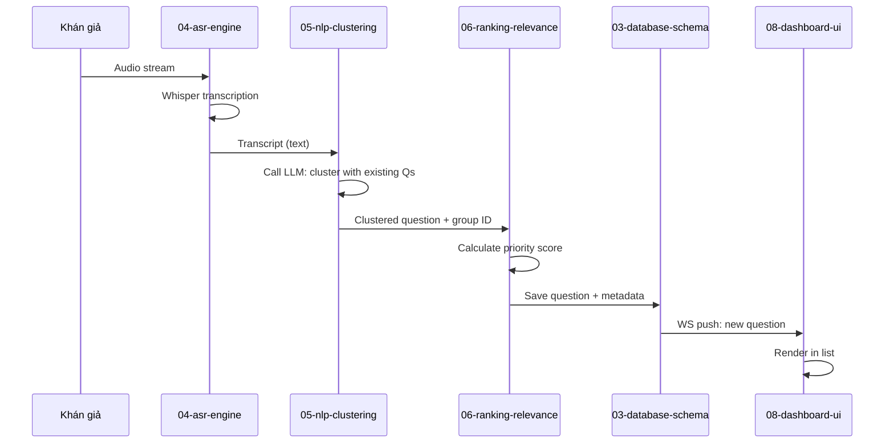

# 01-question-pipeline

Luồng xử lý một câu hỏi từ lúc nhận voice input cho đến lúc được xếp hạng và lưu vào database. Đây là core flow của hệ thống — mỗi bước là một component riêng biệt có thể debug/test độc lập.

## Flow Diagram



## 1. Input Source

Câu hỏi có thể từ 2 nguồn:

| Source | Protocol | Latency Budget | Example |
|--------|----------|-----------------|---------|
| **Microphone (hội trường)** | WebSocket + audio chunks | <2s per chunk | Khán giả nói vào mic |
| **Web/App (khán giả gõ)** | REST POST /questions | <500ms | Gửi text trực tiếp |

## 2. Step 1: ASR (04-asr-engine)

Input: Audio stream (WAV/MP3, any length)  
Output: `transcript: str`, `language: str`, `confidence: float`

```python
# Pseudo-code
transcript = whisper_model.transcribe(audio_chunk)
# Returns: {
#     "text": "Bạn sử dụng công nghệ gì?",
#     "language": "vi",
#     "confidence": 0.92
# }
```

**Key metric:** Transcript ready in <2s from last audio frame.

### Handling errors:
- **Noise too high** (confidence <70%): Mark as `needs_review: true` → moderator can re-record
- **Language detection wrong**: Fall back to VI explicitly
- **Timeout**: Allow manual text input as fallback

## 3. Step 2: NLP Clustering (05-nlp-clustering)

Input: `transcript: str`  
Output: `cluster_group_id: int`, `representative_q: str`, `is_new: bool`

Gọi LLM để:
1. Hiểu ý nghĩa câu hỏi
2. So sánh với các câu hỏi cũ trong DB
3. Nếu trùng → append vào group hiện tại; nếu mới → tạo group mới

```python
# Pseudo-code
prompt = f"""
Previous questions:
{get_similar_questions(embedding)}

New question: {transcript}

Does this match any existing group?
If yes, return GROUP_ID.
If no, return NEW_GROUP.
"""
result = call_llm(prompt)
```

**Output:**
```json
{
  "cluster_group_id": 42,
  "representative_q": "Công nghệ được sử dụng?",
  "is_new": false,
  "count_in_group": 3,
  "similar_qs": ["Bạn dùng tech gì?", "Stack công nghệ?"]
}
```

## 4. Step 3: Ranking (06-ranking-relevance)

Input: `question: str`, `context: EventContext` (speaker topic, time, etc.)  
Output: `priority_score: float` (0-100), `reasoning: str`

Gọi LLM để đánh giá:
- Độ liên quan với speaker topic
- Độ phức tạp (có cần nhiều thời gian trả lời?)
- Độ hay (có thể giáo dục của câu hỏi)

```python
score = call_llm(f"""
Event context: {event_context}
Question: {question}
Rate relevance 0-100: ...
""")
# Returns: score 85, reasoning: "Trực tiếp liên quan..."
```

**Ranking formula:**
```
final_score = (relevance × 0.5) + (novelty × 0.3) + (engagement × 0.2)
```

## 5. Step 4: Storage (03-database-schema)

Lưu 2 document chính và cập nhật 1 cluster document:

| Collection | Record |
|-------|--------|
| `questions` | Original transcript + metadata + embedding |
| `clusters` | Group metadata + representative |

```javascript
db.questions.insertOne({
  eventId: "evt_001",
  transcript: "...",
  clusterId: "cluster_042",
  priorityScore: 85.5,
  embedding: [0.2, 0.5, ...],
  createdAt: new Date()
})

db.clusters.updateOne(
  { _id: "cluster_042" },
  {
    $set: { representativeQuestionId: "q_123" },
    $inc: { countQuestions: 1 }
  }
)
```

## 6. Step 5: Push to Dashboard (02-api-layer)

API broadcast qua WebSocket:

```json
{
  "event": "new_question",
  "data": {
    "id": 123,
    "cluster_id": 42,
    "representative_q": "Công nghệ?",
    "count_in_group": 3,
    "priority_score": 85.5,
    "status": "pending_approval"
  }
}
```

Dashboard render dưới dạng card, moderator có thể:
- **Approve**: Move to "approved" list
- **Edit**: Fix OCR errors từ ASR
- **Skip/Reject**: Move to trash
- **Play**: Trigger TTS

## 7. End State

Câu hỏi nằm trong DB với:
- Original transcript
- Clustered group ID
- Priority ranking
- Approval status
- Ready for TTS when moderator selects

## File Reference

| File | Role |
|------|------|
| `src/agent.py` | Orchestrates all 5 steps |
| `src/pipeline/asr.py` | Step 1: Whisper call |
| `src/pipeline/nlp.py` | Step 2: Clustering LLM |
| `src/pipeline/ranking.py` | Step 3: Relevance scoring |
| `src/models/question.py` | Step 4: Question document schema |
| `src/repositories/mongo.py` | Step 4: MongoDB access layer |
| `src/websocket.py` | Step 5: WebSocket broadcaster |

## Cross-References

| Doc | Why |
|-----|-----|
| [00-architecture-overview.md](00-architecture-overview.md) | Parent context |
| [04-asr-engine.md](04-asr-engine.md) | Step 1 deep dive |
| [05-nlp-clustering.md](05-nlp-clustering.md) | Step 2 deep dive |
| [06-ranking-relevance.md](06-ranking-relevance.md) | Step 3 deep dive |
| [03-database-schema.md](03-database-schema.md) | Step 4 deep dive |
| [02-api-layer.md](02-api-layer.md) | Step 5 endpoint spec |
