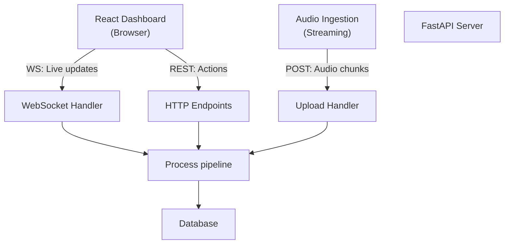

# 02-api-layer

FastAPI backend cung cấp endpoints cho frontend dashboard và audio ingestion. Tất cả realtime updates qua WebSocket, truy vấn dữ liệu qua REST.

## API Overview



## 1. WebSocket Endpoints

Real-time push của questions, statuschanges, playback events.

### `ws://server/ws/dashboard`

**Connected clients:** Moderators tham gia realtime session.

**Broadcast messages (server → client):**

```json
{
  "type": "new_question",
  "data": {
    "id": 123,
    "transcript": "Công nghệ?",
    "priority_score": 85,
    "cluster_id": 42,
    "count_in_group": 3,
    "status": "pending"
  }
}
```

```json
{
  "type": "question_approved",
  "data": { "id": 123, "status": "approved" }
}
```

```json
{
  "type": "tts_playing",
  "data": { "question_id": 123, "audio_url": "..." }
}
```

**Client messages (client → server):**

```json
{
  "action": "approve_question",
  "question_id": 123
}
```

```json
{
  "action": "play_question",
  "question_id": 123
}
```

```json
{
  "action": "edit_question",
  "question_id": 123,
  "new_text": "Công nghệ nào?"
}
```

---

## 2. REST Endpoints

### **Questions**

| Method | Path | Purpose |
|--------|------|---------|
| POST | `/questions` | Submit new question (text) |
| GET | `/questions` | List all questions (with filters) |
| GET | `/questions/{id}` | Get single question detail |
| PATCH | `/questions/{id}` | Edit question text |
| DELETE | `/questions/{id}` | Delete/reject question |

#### `POST /questions`
**Request:**
```json
{
  "transcript": "Bạn sử dụng công nghệ gì?",
  "source": "web" | "voice",
  "cluster_id": 42
}
```

**Response:**
```json
{
  "id": 123,
  "transcript": "...",
  "priority_score": 85.5,
  "cluster_id": 42,
  "status": "pending",
  "created_at": "2026-04-09T10:30:00Z"
}
```

#### `GET /questions?status=pending&sort=priority`

**Response:**
```json
{
  "questions": [
    { "id": 123, "transcript": "...", "priority_score": 85 },
    { "id": 124, "transcript": "...", "priority_score": 75 }
  ],
  "total": 2,
  "next_page": null
}
```

---

### **Events (Session Management)**

| Method | Path | Purpose |
|--------|------|---------|
| POST | `/events` | Create new Q&A session |
| GET | `/events/{id}` | Get session details |
| PATCH | `/events/{id}/status` | Start, pause, end session |

#### `POST /events`
**Request:**
```json
{
  "title": "Tech Conference 2026",
  "speaker_topic": "AI Trends",
  "duration_minutes": 60
}
```

**Response:**
```json
{
  "id": "evt_abc123",
  "title": "Tech Conference 2026",
  "status": "active",
  "created_at": "..."
}
```

---

### **Reports (Post-Event)**

| Method | Path | Purpose |
|--------|------|---------|
| POST | `/events/{id}/generate-report` | Trigger report generation |
| GET | `/events/{id}/report` | Download report (Excel/PDF) |

#### `POST /events/{evt_id}/generate-report`

Trigger batch job: LLM tóm tắt tất cả Q&A, tạo markdown/excel.

**Response:**
```json
{
  "job_id": "job_xyz",
  "status": "processing",
  "estimated_completion": "2026-04-09T11:00:00Z"
}
```

#### `GET /events/{evt_id}/report?format=excel`

**Response:** Download `event_report_2026_04_09.xlsx`

---

### **Audio Upload (ASR Input)**

| Method | Path | Purpose |
|--------|------|---------|
| POST | `/audio/transcribe` | Submit audio for STT |

#### `POST /audio/transcribe`

**Request:**
- Content-Type: `application/octet-stream` or multipart
- Body: Raw audio bytes (WAV, MP3)

**Response:**
```json
{
  "transcript": "Công nghệ?",
  "confidence": 0.92,
  "language": "vi",
  "duration_ms": 3500,
  "question_id": 123
}
```

---

## 3. Error Responses

All errors follow JSON format:

```json
{
  "error": "validation_error",
  "message": "Invalid JSON payload",
  "code": 400
}
```

| Status | Error | When |
|--------|-------|------|
| 400 | `validation_error` | Bad request body |
| 401 | `unauthorized` | Missing token |
| 404 | `not_found` | Resource doesn't exist |
| 429 | `rate_limited` | Too many requests |
| 500 | `internal_error` | Server error; check logs |

---

## 4. Authentication

Use Bearer token (from `.env`):

```
Authorization: Bearer sk-your-api-key
```

**Or:** JWT token from Moderator login.

---

## 5. Rate Limiting

| Endpoint | Limit | Window |
|----------|-------|--------|
| `/questions` POST | 100 | per minute |
| `/audio/transcribe` | 50 | per minute |
| `ws://` | 1000 messages | per minute |

---

## File Reference

| File | Purpose |
|------|---------|
| `src/api/main.py` | FastAPI app initialization |
| `src/api/routes/questions.py` | Question REST endpoints |
| `src/api/routes/events.py` | Event management |
| `src/api/websocket.py` | WebSocket handlers |
| `src/api/schemas.py` | Pydantic request/response models |

## Cross-References

| Doc | Why |
|-----|-----|
| [00-architecture-overview.md](00-architecture-overview.md) | System context |
| [03-database-schema.md](03-database-schema.md) | Data models used here |
| [01-question-pipeline.md](01-question-pipeline.md) | What happens after POST /questions |
