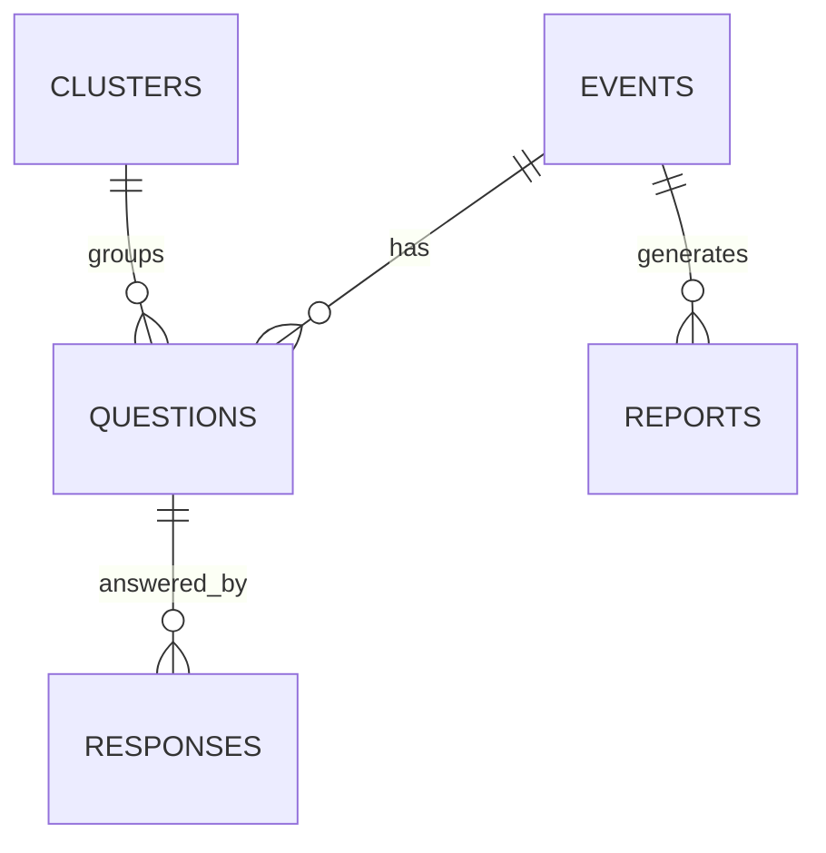

# 03-database-schema

MongoDB document schema cho toan bo du lieu: events, questions, clusters, responses, reports. Embeddings duoc luu ngay trong question document va duoc truy van bang Atlas Vector Search.

## Schema Overview


```

## 1. Core Collections

### `events`

Moi document dai dien cho mot phien Q&A.

```json
{
  "_id": "evt_001",
  "title": "Tech Conference 2026",
  "description": "Q&A session for AI panel",
  "speakerTopic": "AI Trends",
  "status": "active",
  "durationMinutes": 60,
  "maxQuestions": 100,
  "createdAt": "2026-04-09T09:00:00Z",
  "startedAt": "2026-04-09T09:15:00Z",
  "endedAt": null,
  "createdBy": "user_001"
}
```

### `questions`

Moi document la mot cau hoi da qua ASR hoac duoc nhap tu web. Embedding va metadata duoc luu cung document de tranh join phuc tap.

```json
{
  "_id": "q_123",
  "eventId": "evt_001",
  "transcript": "Ban su dung cong nghe gi?",
  "transcriptEdited": null,
  "source": "voice",
  "asrConfidence": 0.92,
  "clusterId": "cluster_042",
  "isRepresentative": true,
  "priorityScore": 85.5,
  "status": "pending",
  "askedBy": null,
  "embedding": [0.12, -0.03, 0.88],
  "metadata": {
    "language": "vi",
    "needsReview": false
  },
  "createdAt": "2026-04-09T09:20:00Z",
  "approvedAt": null,
  "answeredAt": null
}
```

### `clusters`

Luu nhom cau hoi trung lap va representative question.

```json
{
  "_id": "cluster_042",
  "eventId": "evt_001",
  "representativeQuestionId": "q_123",
  "countQuestions": 3,
  "createdAt": "2026-04-09T09:20:03Z"
}
```

### `responses`

Luu cau tra loi cua speaker/moderator cho tung cau hoi da duyet.

```json
{
  "_id": "resp_001",
  "questionId": "q_123",
  "responseText": "Chung toi dung FastAPI va React.",
  "respondedBy": "Speaker A",
  "createdAt": "2026-04-09T09:31:00Z"
}
```

### `reports`

Luu metadata cua file bao cao sau su kien.

```json
{
  "_id": "report_001",
  "eventId": "evt_001",
  "title": "Q&A Log - Tech Conference 2026",
  "summary": "LLM-generated summary",
  "format": "markdown",
  "filePath": "s3://reports/event_001.md",
  "generatedAt": "2026-04-09T10:30:00Z",
  "generatedBy": "user_001"
}
```

## 2. Index Strategy

```javascript
db.events.createIndex({ status: 1, createdAt: -1 })
db.questions.createIndex({ eventId: 1, status: 1, priorityScore: -1 })
db.questions.createIndex({ clusterId: 1, createdAt: -1 })
db.questions.createIndex({ createdAt: -1 })
db.clusters.createIndex({ eventId: 1, createdAt: -1 })
db.responses.createIndex({ questionId: 1 })
```

Atlas Vector Search index cho `questions.embedding`:

```json
{
  "fields": [
    {
      "type": "vector",
      "path": "embedding",
      "numDimensions": 1536,
      "similarity": "cosine"
    },
    {
      "type": "filter",
      "path": "eventId"
    }
  ]
}
```

Optional document validation for `questions`:

```javascript
db.runCommand({
  collMod: "questions",
  validator: {
    $jsonSchema: {
      bsonType: "object",
      required: ["eventId", "transcript", "status", "createdAt"],
      properties: {
        eventId: { bsonType: "string" },
        transcript: { bsonType: "string" },
        status: { enum: ["pending", "approved", "rejected", "answered"] },
        priorityScore: { bsonType: ["double", "int"] }
      }
    }
  }
})
```

## 3. Common Queries

### Get all pending questions for an event, ranked

```javascript
db.questions
  .find({ eventId: "evt_001", status: "pending" })
  .sort({ priorityScore: -1 })
  .limit(50)
```

### Get all questions in a cluster

```javascript
db.questions
  .find({ clusterId: "cluster_042" })
  .sort({ priorityScore: -1, createdAt: -1 })
```

### Find similar questions using Atlas Vector Search

```javascript
db.questions.aggregate([
  {
    $vectorSearch: {
      index: "question_embedding_index",
      path: "embedding",
      queryVector: embedding,
      numCandidates: 50,
      limit: 5,
      filter: { eventId: "evt_001", status: { $ne: "rejected" } }
    }
  },
  {
    $project: {
      transcript: 1,
      score: { $meta: "vectorSearchScore" }
    }
  }
])
```

### Count questions per status

```javascript
db.questions.aggregate([
  { $match: { eventId: "evt_001" } },
  { $group: { _id: "$status", count: { $sum: 1 } } }
])
```

## 4. Data Storage Strategy

| Data | Store Where | Why |
|------|-------------|-----|
| **Audio files** | S3 / cloud storage | Large blobs; temporary after transcription |
| **Transcripts** | MongoDB documents | Flexible structure, easy append metadata |
| **Embeddings** | MongoDB `questions.embedding` | Keep semantic search close to question data |
| **Event reports** | S3 with metadata in MongoDB | Large exports; accessible via URL |
| **User sessions** | Redis | Temporary, expire after session |

## 5. Backup & Retention

| Data | Retention | Backup Frequency |
|------|-----------|------------------|
| **Active events** | Keep indefinitely | Daily |
| **Questions** | Keep 1 year | Daily |
| **Audio files** | Delete after 24h | None needed |
| **Embeddings** | Keep with question document | Daily |
| **Reports** | Keep 1 year | Daily |

## File Reference

| File | Purpose |
|------|---------|
| `src/repositories/mongo.py` | MongoDB connection and collection access |
| `src/models/question.py` | Question document schema |
| `src/models/event.py` | Event document schema |
| `src/database.py` | Client initialization and indexes |

## Cross-References

| Doc | Why |
|-----|-----|
| [00-architecture-overview.md](00-architecture-overview.md) | System context |
| [02-api-layer.md](02-api-layer.md) | What data APIs read/write |
| [05-nlp-clustering.md](05-nlp-clustering.md) | How embeddings are searched |
