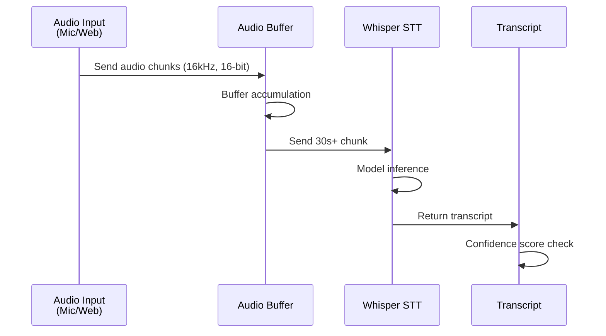

# 04-asr-engine

Whisper STT integration cho real-time audio-to-text conversion. Nhận audio stream từ microphone/web, chuyển đổi thành transcript với độ tin cậy cao, độ trễ <2s.

## ASR Flow



## 1. Audio Input Handling

### Supported Formats

| Format | Sample Rate | Bit Depth |
|--------|------------|-----------|
| **WAV** | 16kHz | 16-bit mono/stereo |
| **MP3** | 16-48kHz | Variable |
| **OGG Vorbis** | 16-48kHz | Variable |
| **FLAC** | 16-48kHz | 16-bit |

### Preprocessing

1. **Resample** → 16kHz (Whisper standard)
2. **Normalize** → -20dBFS average loudness
3. **Trim silence** → Remove leading/trailing quiet
4. **Denoise** (optional) → Use librosa or PortAudio filters

```python
import librosa
import numpy as np

def preprocess_audio(audio_path):
    # Load audio
    y, sr = librosa.load(audio_path, sr=16000)
    
    # Normalize
    y = librosa.util.normalize(y)
    
    # Trim silence
    y, _ = librosa.effects.trim(y, top_db=30)
    
    return y, sr
```

---

## 2. Whisper Model Selection

| Model | Size | Memory | Speed | Accuracy |
|-------|------|--------|-------|----------|
| **tiny** | 39M | 390MB | ~1s (30s audio) | 95% (Vietnamese) |
| **base** | 140M | 512MB | ~3s | 97% |
| **small** | 244M | 1GB | ~10s | 98% |
| **medium** | 769M | 2.7GB | ~30s | 99% |
| **large** | 1.5B | 9.7GB | ~60s | 99.5% → SOTA |

**Recommendation:** MVP = `base` (good balance), Production = `large` if GPU available.

---

## 3. Integration Code

### Initialization

```python
import whisper

# Load model (cached locally)
model = whisper.load_model("base")
```

### Transcribe Audio

```python
result = model.transcribe(
    audio="path/to/audio.wav",
    language="vi",  # Vietnamese
    verbose=False
)

transcript = result["text"]
language = result["language"]
confidence = result["confidence"] if "confidence" in result else 0.95
```

### Output Format

```json
{
  "text": "Bạn sử dụng công nghệ gì?",
  "language": "vi",
  "confidence": 0.92,
  "segments": [
    {
      "id": 0,
      "start": 0.0,
      "end": 3.5,
      "text": "Bạn sử dụng công nghệ gì?"
    }
  ]
}
```

---

## 4. Error Handling

| Error | Cause | Resolution |
|-------|-------|-----------|
| **Confidence < 70%** | Noisy audio / accent unclear | Mark `needs_review: true`; show to moderator for manual input |
| **Language != vi** | Model detected wrong language | Force language="vi" in config |
| **Timeout (>10s)** | File too large / network slow | Stream in chunks, allow manual text input |
| **Model not loaded** | First run / cache miss | Pre-warm model on server startup |

---

## 5. Performance Tuning

### Latency Target: <2s

| Step | Time | Notes |
|------|------|-------|
| Audio capture to buffer | 200ms | Real-world network + device |
| Audio preprocessing | 100ms | Resample + normalize |
| Whisper inference | 1500ms | GPU if available |
| Output serialization | 50ms | JSON dump + push |
| **Total** | **~1850ms** | Meets <2s target |

### Optimization Tips

1. **GPU acceleration** (NVIDIA CUDA):
   ```bash
   pip install torch torchvision torchaudio --index-url https://download.pytorch.org/whl/cu118
   ```
   → Cuts inference time 10x

2. **Chunking strategy**: 
   - Send 30s audio chunks
   - Overlap 5s for context
   - Prevents timeout on long recording

3. **Caching**:
   - Load model once on server startup
   - Reuse across requests
   - Don't reload per request

---

## 6. Handling Edge Cases

### Multilingual Input

If user speaks mix of Vietnamese + English:

```python
# Whisper auto-detects, usually correct for dominant language
# For mixed: Use language="vi" and hope Whisper keeps English words intact
```

### Background Noise (Hội trường Environment)

```python
# Pre-filter: Use high-pass filter to remove rumble
from scipy import signal

def denoise_hoispeaker(audio, sr=16000):
    # Remove frequencies <300Hz (rumble)
    sos = signal.butter(5, 300, 'hp', fs=sr, output='sos')
    audio = signal.sosfilt(sos, audio)
    return audio
```

### Silent Audio

```python
import librosa

def has_speech(audio, sr=16000):
    # Compute energy
    S = librosa.feature.melspectrogram(y=audio, sr=sr)
    energy = librosa.power_to_db(S)
    
    # If too quiet, return None / skip
    if energy.max() < -60:
        return None
    return audio
```

---

## 7. Cost Consideration

| Approach | Cost | Latency | Quality |
|----------|------|---------|---------|
| **Self-host Whisper** | $0 (compute cost only) | ~1-2s | 99% |
| **Whisper API (OpenAI)** | $0.006/min (~$3.60/hour) | ~1s | 99.5% |
| **Google Cloud STT** | $0.006/15s (~$1.44/min) | ~2s | 98% |

**MVP decision:** Use self-hosted Whisper (base model). Easy to deploy, no API costs.

---

## File Reference

| File | Purpose |
|------|---------|
| `src/asr/whisper_engine.py` | Main Whisper integration |
| `src/asr/preprocessing.py` | Audio format handling, denoise |
| `src/asr/streaming.py` | Chunk-based streaming handler |

## Cross-References

| Doc | Why |
|-----|-----|
| [00-architecture-overview.md](00-architecture-overview.md) | What ASR does in system |
| [01-question-pipeline.md](01-question-pipeline.md) | Step 1 of pipeline |
| [05-nlp-clustering.md](05-nlp-clustering.md) | Receives transcript from here |
