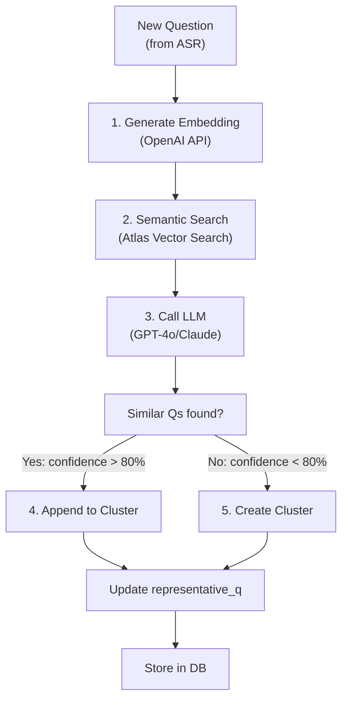

# 05-nlp-clustering

Question clustering sử dụng LLM + vector similarity để gộp các câu hỏi có ý nghĩa giống nhau. Nếu duplicate → append vào group hiện tại; nếu mới → tạo group mới.

## Clustering Flow



## 1. Embedding Generation

Each question → vector (1536D for OpenAI embedding-3-small).

```python
from openai import OpenAI

client = OpenAI()

def get_embedding(text: str) -> list[float]:
    response = client.embeddings.create(
        input=text,
        model="text-embedding-3-small"
    )
    return response.data[0].embedding
```

**Cost:** ~$0.02 per 1M tokens. For 100 questions = <$1.

---

## 2. Semantic Search (Vector DB)

Find top-K most similar questions already in DB using MongoDB Atlas Vector Search.

```python
from pymongo import MongoClient

client = MongoClient(MONGODB_URI)
questions = client.app.questions

def find_similar_questions(embedding: list[float], event_id: str, top_k: int = 5):
    """Find questions with highest cosine similarity."""
    pipeline = [
        {
            "$vectorSearch": {
                "index": "question_embedding_index",
                "path": "embedding",
                "queryVector": embedding,
                "numCandidates": 50,
                "limit": top_k,
                "filter": {
                    "eventId": event_id,
                    "status": {"$ne": "rejected"}
                }
            }
        },
        {
            "$project": {
                "transcript": 1,
                "clusterId": 1,
                "score": {"$meta": "vectorSearchScore"}
            }
        }
    ]
    return list(questions.aggregate(pipeline))
```

**Example output:**
```python
[
    (123, "Công nghệ backend?", 0.92),      # Very similar
    (124, "Tech stack dùng?", 0.88),        # Similar
    (125, "Họp gì trong hội thảo?", 0.45),  # Not similar
]
```

---

## 3. LLM-Based Clustering Decision

Call LLM to determine if new question belongs to existing cluster.

```python
from openai import OpenAI

def should_cluster(
    new_question: str,
    existing_questions: list[str]
) -> dict:
    """Decide if new question should join existing cluster."""
    
    prompt = f"""You are a question clustering expert for seminars.

Given:
- NEW QUESTION: "{new_question}"
- EXISTING CLUSTER QUESTIONS:
{chr(10).join([f'- "{q}"' for q in existing_questions])}

Do these questions represent the SAME semantic meaning?
Answer in JSON:
{{
  "should_cluster": true/false,
  "confidence": 0.0-1.0,
  "reasoning": "explanation"
}}

Requirements:
- 동의어 같은 건 yes (ex: "tech stack" vs "công nghệ dùng")
- Follow-up Qs = no (과거 다르다)
- Very different context = no
"""
    
    response = client.chat.completions.create(
        model="gpt-4o",
        messages=[{"role": "user", "content": prompt}],
        response_format={"type": "json_object"},
        temperature=0.3
    )
    
    return json.loads(response.choices[0].message.content)
```

**Example flow:**
```python
new_q = "Bạn dùng Python hay JavaScript?"
existing = [
    "Ngôn ngữ lập trình nào?",
    "Stack công nghệ?",
    "Mình dùng React hay Vue?"  # This one is different
]

result = should_cluster(new_q, existing)
# {
#   "should_cluster": true,
#   "confidence": 0.87,
#   "reasoning": "Similar topics about technology choice"
# }
```

---

## 4. Clustering Thresholds

| Threshold | Action |
|-----------|--------|
| **confidence >= 85%** | Auto-cluster → append to group |
| **confidence 70-85%** | Manual review flag → moderator decides |
| **confidence < 70%** | Create new cluster (safe mode) |

---

## 5. Cluster Representative Selection

Every cluster has ONE representative question (shown on dashboard).

**Strategy:** Longest + highest-priority question = representative

```python
def update_representative(cluster_id: int):
    """Select best Q in cluster as representative."""
    
    query = """
    SELECT id, transcript, priority_score
    FROM questions
    WHERE cluster_id = %s
    ORDER BY 
      priority_score DESC,
      LENGTH(transcript) DESC
    LIMIT 1
    """
    
    cursor.execute(query, (cluster_id,))
    best_q = cursor.fetchone()
    
    # Update representative flag
    cursor.execute(
        "UPDATE clusters SET representative_question_id = %s WHERE id = %s",
        (best_q[0], cluster_id)
    )
    cursor.execute(
        "UPDATE questions SET is_representative = TRUE WHERE id = %s",
        (best_q[0],)
    )
```

---

## 6. Handling Ambiguous Cases

### Case 1: New Question Similar to Multiple Clusters

→ Join cluster with highest confidence.

### Case 2: Very Long Question (Rambling)

→ LLM summarizes before clustering

```python
def summarize_long_question(text: str) -> str:
    """If >100 words, ask LLM to summarize."""
    
    if len(text.split()) < 100:
        return text
    
    response = client.chat.completions.create(
        model="gpt-4o",
        messages=[{
            "role": "user",
            "content": f'Summarize this question in 1-2 sentences:\n{text}'
        }],
        temperature=0.5,
        max_tokens=50
    )
    
    return response.choices[0].message.content
```

### Case 3: Language Mix (Vietnamese + English)

→ Keep as-is; LLM handles mixed language

---

## 7. Clustering Metrics

Track clustering quality:

| Metric | Target | Meaning |
|--------|--------|---------|
| **Precision** | >90% | Clustered Qs actually similar |
| **Recall** | >80% | Find duplicates (not miss any) |
| **Avg cluster size** | 2-3 | Not too many in 1 group |
| **Clustering latency** | <1s | Keep <<2s total pipeline |

---

## 8. Error Recovery

| Error | Mitigation |
|-------|-----------|
| **Embedding API down** | Fall back to simple text comparison (substring match) |
| **LLM timeout** | Use vector similarity score directly (skip LLM) |
| **DB vector search fails** | Return top questions by created_at (newest first) |

---

## File Reference

| File | Purpose |
|------|---------|
| `src/nlp/clustering.py` | Main clustering logic |
| `src/nlp/embeddings.py` | Embedding generation |
| `src/repositories/mongo.py` | Atlas Vector Search access |
| `src/nlp/prompts.py` | LLM prompts for clustering |

## Cross-References

| Doc | Why |
|-----|-----|
| [00-architecture-overview.md](00-architecture-overview.md) | Where clustering fits |
| [01-question-pipeline.md](01-question-pipeline.md) | Step 2 of pipeline |
| [03-database-schema.md](03-database-schema.md) | Clusters & embeddings tables |
| [06-ranking-relevance.md](06-ranking-relevance.md) | Uses clustered groups |
