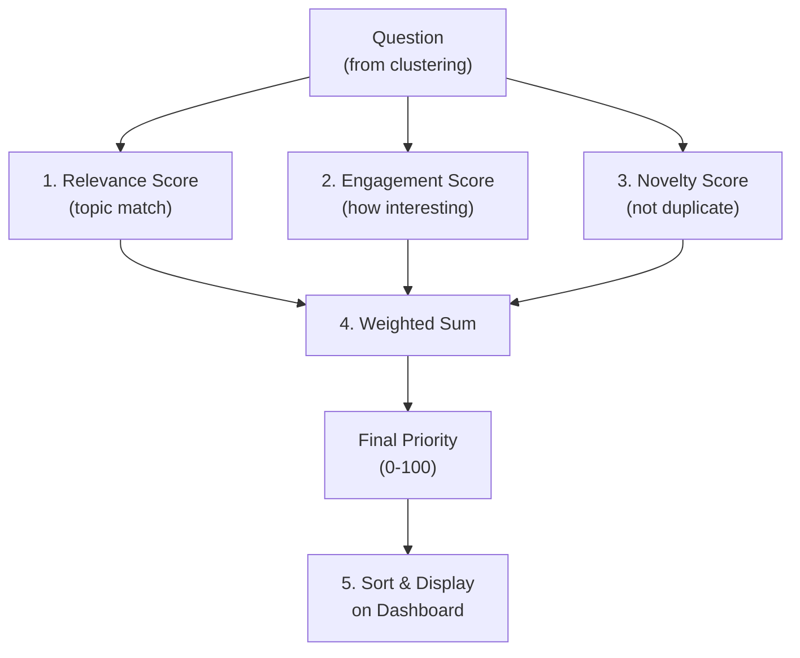

# 06-ranking-relevance

Priority scoring mỗi câu hỏi dựa trên liên quan (relevance), độ hay (engagement), độ mới (novelty). Dùng kết hợp rule-based + LLM scoring.

## Ranking Flow



## 1. Relevance Score (0-100)

**Goal:** How much this question relates to speaker's topic.

### Method: LLM-based

```python
def calculate_relevance(
    question: str,
    event_context: dict  # { topic, keywords, speaker_bio }
) -> float:
    """Ask LLM to rate relevance to event."""
    
    prompt = f"""
You are a question rating expert for seminars.

EVENT CONTEXT:
- Topic: {event_context['topic']}
- Keywords: {', '.join(event_context['keywords'])}
- Speaker: {event_context['speaker_name']} ({event_context['speaker_bio']})

QUESTION: "{question}"

Rate RELEVANCE (how directly this relates to the topic):
- 100 = Directly addresses topic, core question
- 70 = Related but tangential
- 40 = Loosely related, general curiosity
- 10 = Off-topic, barely relevant

Return JSON: {{"relevance_score": 0-100, "reasoning": "..."}}
"""
    
    response = client.chat.completions.create(
        model="gpt-4o",
        messages=[{"role": "user", "content": prompt}],
        response_format={"type": "json_object"},
        temperature=0.3
    )
    
    result = json.loads(response.choices[0].message.content)
    return result["relevance_score"]
```

**Examples:**
- "What's your tech stack?" @ Tech Conference → 95
- "Do you use AI?" @ AI Conference → 85
- "What's your favorite color?" @ Tech Conference → 5

---

## 2. Engagement Score (0-100)

**Goal:** How interesting/valuable this question is for the audience.

### Method: Rule-based + LLM

```python
def calculate_engagement(question: str, event_context: dict) -> float:
    """Estimate how engaging/valuable this question is."""
    
    score = 50  # baseline
    
    # Rule 1: Question contains action verb?
    action_verbs = ['how', 'why', 'can', 'will', 'should', 'would', 'giải quyết', 'cách']
    if any(verb in question.lower() for verb in action_verbs):
        score += 15
    
    # Rule 2: Question is reasonably long (not one-word)?
    if 5 <= len(question.split()) <= 30:
        score += 10
    elif len(question.split()) > 30:
        score += 5  # Too long = rambling
    
    # Rule 3: LLM judges overall engagement
    llm_prompt = f"""
Question: "{question}"
Context: {event_context['topic']}

Is this question likely to spark discussion/interest?
Rate 0-100 where:
- 80+ = Very engaging, educational
- 50-79 = Okay, some value
- <50 = Not very interesting

Return: {{"engagement": 0-100}}
"""
    
    try:
        response = client.chat.completions.create(
            model="gpt-4o",
            messages=[{"role": "user", "content": llm_prompt}],
            response_format={"type": "json_object"},
            temperature=0.3,
            max_tokens=50
        )
        llm_result = json.loads(response.choices[0].message.content)
        score = int((score + llm_result["engagement"]) / 2)
    except:
        pass  # Fall back to rule-based score
    
    return min(score, 100)
```

**Examples:**
- "How do you scale machine learning models?" → 85
- "What's 2+2?" → 15
- "Can you recommend resources?" → 75

---

## 3. Novelty Score (0-100)

**Goal:** Duplicate questions should score lower. First instance of a topic = higher.

### Method: Cluster position

```python
def calculate_novelty(
    question_id: int,
    cluster_id: int,
    total_in_cluster: int
) -> float:
    """
    Score based on position in cluster.
    First Q = novel, Nth Q = repetitive.
    """
    
    # Check if this is the representative (first) of cluster
    query = """
    SELECT is_representative FROM questions WHERE id = %s
    """
    cursor.execute(query, (question_id,))
    is_rep = cursor.fetchone()[0]
    
    if is_rep:
        return 100  # First of its kind = most novel
    
    # Apply decay: Nth question = lower score
    # 2nd Q = 80, 3rd Q = 60, etc.
    novelty = max(20, 100 - (total_in_cluster - 1) * 20)
    
    return novelty
```

**Examples:**
- Question 1 in cluster → 100
- Question 2 in same cluster → 80
- Question 3 in same cluster → 60

---

## 4. Final Priority Score (Weighted Sum)

```python
def calculate_final_priority(
    question_id: int,
    relevance: float,
    engagement: float,
    novelty: float,
    weights: dict = None
) -> float:
    """
    Combine 3 scores with configurable weights.
    Default: relevance 50%, engagement 30%, novelty 20%
    """
    
    if weights is None:
        weights = {
            "relevance": 0.5,
            "engagement": 0.3,
            "novelty": 0.2
        }
    
    final = (
        relevance * weights["relevance"] +
        engagement * weights["engagement"] +
        novelty * weights["novelty"]
    )
    
    return min(final, 100)
```

**Example:**
```python
# Question A
relevance = 95
engagement = 80
novelty = 100
priority = 0.95*0.5 + 0.80*0.3 + 1.0*0.2 = 0.475 + 0.24 + 0.2 = 0.915 → 91.5

# Question B (duplicate, off-topic)
relevance = 40
engagement = 30
novelty = 20
priority = 0.40*0.5 + 0.30*0.3 + 0.2*0.2 = 0.20 + 0.09 + 0.04 = 0.33 → 33
```

---

## 5. Dynamic Reranking

As time progresses, boost/demote scores:

```python
def adjust_for_time(priority: float, age_seconds: int) -> float:
    """
    Older questions → boost (been waiting)
    Very new questions → slight penalty (let others catch up)
    """
    
    if age_seconds < 5:  # Very fresh
        return priority * 0.95
    elif age_seconds > 60:  # Waiting >1min
        return min(priority * 1.1, 100)  # Boost up to 100
    else:
        return priority
```

---

## 6. Metrics & Validation

Track ranking quality:

| Metric | Target |
|--------|--------|
| **Avg ranking latency** | <500ms |
| **Ranking consensus** | If 2 moderators score same Q, ±10 points |
| **Moderator override rate** | <20% (ranking usually correct) |

---

## 7. Configuration

Allow moderators to tune weights based on event type:

| Event Type | Relevance | Engagement | Novelty |
|-----------|-----------|-----------|---------|
| **Academic Seminar** | 0.7 | 0.2 | 0.1 |
| **Product Launch** | 0.5 | 0.4 | 0.1 |
| **Community AMA** | 0.3 | 0.5 | 0.2 |
| **Board Meeting** | 0.6 | 0.2 | 0.2 |

---

## File Reference

| File | Purpose |
|------|---------|
| `src/ranking/relevance.py` | Relevance scoring |
| `src/ranking/engagement.py` | Engagement scoring |
| `src/ranking/novelty.py` | Novelty calculation |
| `src/ranking/priority.py` | Final priority aggregation |

## Cross-References

| Doc | Why |
|-----|-----|
| [00-architecture-overview.md](00-architecture-overview.md) | Where ranking fits |
| [01-question-pipeline.md](01-question-pipeline.md) | Step 3 of pipeline |
| [05-nlp-clustering.md](05-nlp-clustering.md) | Works on clustered questions |
| [08-dashboard-ui.md](08-dashboard-ui.md) | Uses priority for display order |
