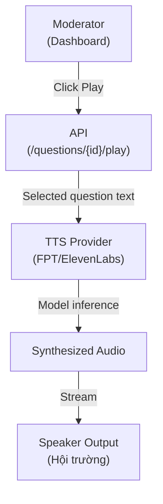

# 07-tts-engine

Text-to-Speech integration để đọc các câu hỏi được duyệt cho khán phòng và diễn giả. Hỗ trợ FPT.AI (Vietnamese) hoặc ElevenLabs (natural voice).

## TTS Flow



## 1. TTS Provider Selection

### Option A: FPT.AI (Vietnamese Native)

**Pros:**
- Best Vietnamese pronunciation
- Contextual emphasis (dấu hỏi, dấu chấm)
- No translation needed

**Cons:**
- Requires API key (closed source)
- Might be blocked in some regions

### Option B: ElevenLabs (Multilingual)

**Pros:**
- Very natural voice (AI-trained)
- Good Vietnamese support
- Global accessibility

**Cons:**
- Free tier: limited minutes
- Slightly lower Vietnamese fluency than FPT

### MVP Recommendation: FPT.AI (native, best quality)

---

## 2. FPT.AI Integration

```python
import requests
from typing import Optional

class FPTTextToSpeech:
    def __init__(self, api_key: str):
        self.api_key = api_key
        self.base_url = "https://api.fpt.ai/hme/tts/v5"
    
    def synthesize(
        self,
        text: str,
        voice_id: str = "female_1",  # 'male_1', 'female_1', 'female_2', etc.
        speed: float = 1.0
    ) -> Optional[bytes]:
        """
        Convert text to speech.
        Returns: Audio bytes (WAV format)
        """
        
        payload = {
            "text": text,
            "voice_id": voice_id,
            "speed": speed
        }
        
        headers = {
            "Authorization": f"Bearer {self.api_key}",
            "Content-Type": "application/json"
        }
        
        try:
            response = requests.post(
                self.base_url,
                json=payload,
                headers=headers,
                timeout=10
            )
            response.raise_for_status()
            return response.content  # Audio bytes
        except requests.RequestException as e:
            print(f"FPT TTS error: {e}")
            return None

# Usage
tts = FPTTextToSpeech(api_key="your-api-key")
audio_bytes = tts.synthesize("Công nghệ nào được sử dụng?")
```

---

## 3. ElevenLabs Integration (Alternative)

```python
from elevenlabs.client import ElevenLabs

class ElevenLabsTextToSpeech:
    def __init__(self, api_key: str):
        self.client = ElevenLabs(api_key=api_key)
        self.voice_id = "nPczCjzI2voJP4VD"  # Dorothy voice (good for Vietnamese)
    
    def synthesize(
        self,
        text: str,
        voice_id: Optional[str] = None
    ) -> Optional[bytes]:
        """Convert text to speech using ElevenLabs."""
        
        if voice_id is None:
            voice_id = self.voice_id
        
        try:
            audio = self.client.generate(
                text=text,
                voice=voice_id,
                model="eleven_monolingual_v1"
            )
            return b"".join(audio)  # Combine audio chunks
        except Exception as e:
            print(f"ElevenLabs TTS error: {e}")
            return None

# Usage
tts = ElevenLabsTextToSpeech(api_key="your-api-key")
audio_bytes = tts.synthesize("Công nghệ nào?")
```

---

## 4. Audio Playback

### In-Browser Playback

```javascript
// JavaScript (React component)
function PlayQuestionButton({ questionText, questionId }) {
    const [playing, setPlaying] = useState(false);
    
    const handlePlay = async () => {
        setPlaying(true);
        
        try {
            const response = await fetch(`/api/questions/${questionId}/play`, {
                method: 'POST'
            });
            
            const audioBlob = await response.blob();
            const audioUrl = URL.createObjectURL(audioBlob);
            
            const audio = new Audio(audioUrl);
            audio.play();
            
            audio.onended = () => setPlaying(false);
        } catch (error) {
            console.error('Play error:', error);
            setPlaying(false);
        }
    };
    
    return (
        <button 
            onClick={handlePlay} 
            disabled={playing}
        >
            {playing ? "Playing..." : "🔊 Play"}
        </button>
    );
}
```

### Speaker Output (Hội Trường)

```python
import pyaudio
import wave

def play_audio_on_speaker(audio_bytes: bytes):
    """Play audio through system speaker (hội trường setup)."""
    
    # Write to temporary WAV file
    with open("/tmp/question.wav", "wb") as f:
        f.write(audio_bytes)
    
    # Play using OS command
    import subprocess
    import platform
    
    if platform.system() == "Windows":
        subprocess.run(["powershell", "-c", "start-process /tmp/question.wav"])
    elif platform.system() == "Darwin":  # macOS
        subprocess.run(["open", "/tmp/question.wav"])
    else:  # Linux
        subprocess.run(["ffplay", "-nodisp", "-autoexit", "/tmp/question.wav"])
```

---

## 5. API Endpoint

### `POST /questions/{question_id}/play`

**Request:**
```json
{
  "voice_id": "female_1",
  "speed": 1.0
}
```

**Response:**
```
Content-Type: audio/wav
Content-Length: 45230
[WAV audio stream]
```

**Backend code:**
```python
@app.post("/questions/{question_id}/play")
async def play_question(question_id: int):
    # Get question from DB
    question = db.query(Question).filter(Question.id == question_id).first()
    if not question:
        raise HTTPException(status_code=404, detail="Question not found")
    
    # Get representative text (if clustered)
    text = question.transcript_edited or question.transcript
    
    # Synthesize speech
    tts = FPTTextToSpeech(api_key=os.getenv("FPT_API_KEY"))
    audio_bytes = tts.synthesize(text)
    
    if not audio_bytes:
        raise HTTPException(status_code=500, detail="TTS synthesis failed")
    
    # Return audio stream
    return StreamingResponse(
        io.BytesIO(audio_bytes),
        media_type="audio/wav"
    )
```

---

## 6. Voice Options

### FPT.AI Voices

| Voice ID | Gender | Tone | Use Case |
|----------|--------|------|----------|
| `male_1` | Male | Neutral | Default announcer |
| `female_1` | Female | Neutral | Default announcer |
| `female_2` | Female | Warm | Friendly moderator |
| `male_2` | Male | Professional | Formal event |

Allow moderator to select voice via dashboard dropdown.

---

## 7. Error Handling

| Error | Mitigation |
|-------|-----------|
| **TTS API timeout (>10s)** | Cancel & notify moderator to retry |
| **API rate limit** | Queue questions, play in order |
| **Speaker not available** | Fall back to browser audio |
| **Empty text** | Skip playback, log warning |

---

## 8. Performance & Cost

| Provider | Cost per 1000 chars | Latency |
|----------|------------------|---------|
| **FPT.AI** | ~$0.001-0.01 | 1-3s |
| **ElevenLabs** | $0.001 per char | 1-2s |

**For MVP:** ~500 questions × 50 avg chars = 25,000 chars ≈ $0.25-0.50 per event.

---

## File Reference

| File | Purpose |
|------|---------|
| `src/tts/fpt_engine.py` | FPT.AI integration |
| `src/tts/elevenlabs_engine.py` | ElevenLabs integration |
| `src/tts/base.py` | Abstract TTS interface |
| `src/api/routes/questions.py` | Play endpoint |

## Cross-References

| Doc | Why |
|-----|-----|
| [00-architecture-overview.md](00-architecture-overview.md) | Where TTS fits (final output) |
| [01-question-pipeline.md](01-question-pipeline.md) | Last step of pipeline |
| [02-api-layer.md](02-api-layer.md) | /play endpoint spec |
