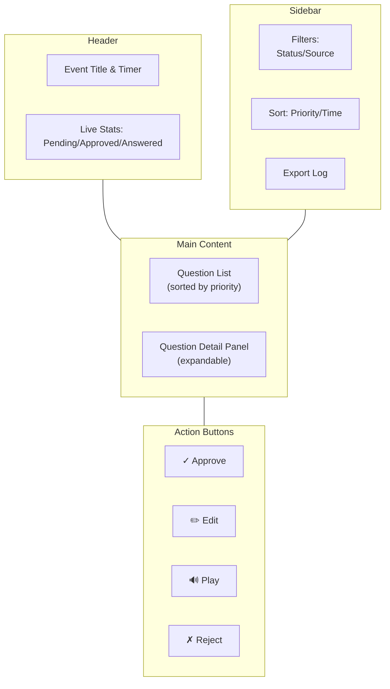

# 08-dashboard-ui

React frontend cho moderators: realtime Q&A list, clustering view, approval workflow, playback control, event analytics.

## Dashboard Layout



## 1. Core Views

### View 1: Pending Questions (Main)

**Displays:** All unapproved questions, ranked by priority (highest first).

```tsx
interface QuestionCard {
  id: number;
  cluster_id?: number;
  transcript: string;  // Or edited version
  priority_score: number;
  status: "pending" | "approved" | "rejected" | "answered";
  count_in_cluster: number;  // e.g. "2/5" (this is 2nd of 5)
  source: "web" | "voice";
  created_at: string;
}

// Component
<QuestionCard
  question={q}
  onApprove={() => approveQuestion(q.id)}
  onEdit={() => editQuestion(q.id)}
  onPlay={() => playQuestion(q.id)}
  onReject={() => rejectQuestion(q.id)}
/>
```

### View 2: Clustering View

Show all questions in a cluster together.

```tsx
<ClusterView
  cluster_id={42}
  questions={[
    { id: 123, transcript: "Tech stack?", is_representative: true },
    { id: 124, transcript: "Công nghệ dùng?", is_representative: false },
    { id: 125, transcript: "Backend framework?", is_representative: false }
  ]}
/>
```

### View 3: Answered Q&A

Historical record of questions asked + speaker responses.

```tsx
<AnsweredQALog
  items={[
    { question: "Tech stack?", answer: "We use Python + React", answered_at: "10:45" },
    { question: "Scale strategy?", answer: "Microservices + k8s", answered_at: "10:52" }
  ]}
/>
```

---

## 2. Real-time Updates (WebSocket)

Dashboard listens to WebSocket for live updates:

```typescript
useEffect(() => {
    const ws = new WebSocket("ws://localhost:8000/ws/dashboard");
    
    ws.onmessage = (event) => {
        const msg = JSON.parse(event.data);
        
        switch (msg.type) {
            case "new_question":
                // Add to list, re-sort by priority
                setQuestions(prev => [...prev, msg.data].sort(...));
                break;
            
            case "question_approved":
                // Update status
                setQuestions(prev => prev.map(q => 
                    q.id === msg.data.id ? {...q, status: 'approved'} : q
                ));
                break;
            
            case "tts_playing":
                // Show audio indicator
                setPlayingQId(msg.data.question_id);
                break;
        }
    };
    
    return () => ws.close();
}, []);
```

---

## 3. Actions & Workflows

### Approve Question

```typescript
const approveQuestion = async (questionId: number) => {
    const response = await fetch(`/api/questions/${questionId}`, {
        method: 'PATCH',
        body: JSON.stringify({ status: 'approved' })
    });
    
    if (response.ok) {
        // UI updates via WebSocket broadcast
    }
};
```

### Edit Question (OCR Fix)

```tsx
<EditQuestionModal
  question={q}
  onSave={async (newText) => {
    await fetch(`/api/questions/${q.id}`, {
      method: 'PATCH',
      body: JSON.stringify({ transcript_edited: newText })
    });
  }}
/>
```

### Play Question

```typescript
const playQuestion = async (questionId: number) => {
    setPlayingQId(questionId);
    
    try {
        const response = await fetch(`/api/questions/${questionId}/play`, {
            method: 'POST'
        });
        const audio = await response.blob();
        const audioUrl = URL.createObjectURL(audio);
        const audioElement = new Audio(audioUrl);
        
        audioElement.onended = () => setPlayingQId(null);
        audioElement.play();
    } catch (error) {
        console.error('Play error:', error);
        setPlayingQId(null);
    }
};
```

### Reject Question

```typescript
const rejectQuestion = async (questionId: number) => {
    await fetch(`/api/questions/${questionId}`, {
        method: 'DELETE'
    });
    // Remove from list
};
```

---

## 4. Filters & Sorting

**Filters (Sidebar):**
- Status: Pending / Approved / Answered / All
- Source: Voice / Web / All
- Priority Range: 0-50 / 50-75 / 75+ (slider)

**Sort Options:**
- By Priority (default)
- By Time (newest first)
- By Cluster Size (most duplicates first)

```tsx
<FilterBar
  status={filterStatus}
  onStatusChange={(val) => setFilterStatus(val)}
  sortBy={sortBy}
  onSortChange={(val) => setSortBy(val)}
/>
```

---

## 5. Event Stats Panel

Real-time counters at top of screen:

```tsx
<EventStats
  total_questions={156}
  pending={12}
  approved={34}
  answered={110}
  clusters={28}
  avg_time_to_answer={3.5}  // minutes
/>
```

---

## 6. Session Management

**Start Event:**
```jsx
<StartEventButton
  onStart={async (eventTitle) => {
    const resp = await fetch('/api/events', {
      method: 'POST',
      body: JSON.stringify({ title: eventTitle })
    });
  }}
/>
```

**End Event & Generate Report:**
```jsx
<EndEventButton
  onEnd={async (eventId) => {
    await fetch(`/api/events/${eventId}/status`, {
      method: 'PATCH',
      body: JSON.stringify({ status: 'ended' })
    });
    
    // Trigger report generation
    const reportJob = await fetch(`/api/events/${eventId}/generate-report`, {
      method: 'POST'
    });
  }}
/>
```

---

## 7. Mobile Responsiveness

Dashboard works on tablet for moderators to move around during seminar:

| Breakpoint | Layout |
|-----------|--------|
| **Mobile (<768px)** | Single column, collapse sidebar |
| **Tablet (768px-1024px)** | 2 columns, smaller cards |
| **Desktop (>1024px)** | Full 3-section layout |

---

## 8. Dark Mode Support

```tsx
const [darkMode, setDarkMode] = useState(false);

return (
  <div className={darkMode ? 'bg-gray-900 text-white' : 'bg-white text-black'}>
    {/* Dashboard content */}
  </div>
);
```

---

## 9. Accessibility

- Keyboard shortcuts: Arrow keys to navigate, Enter to approve
- ARIA labels on buttons
- High-contrast mode option
- Screen reader friendly

---

## 10. Development Stack

```json
{
  "react": "^18.2.0",
  "react-router": "^6.0.0",
  "tailwindcss": "^3.0.0",
  "zustand": "^4.0.0",
  "react-query": "^3.39.0",
  "ws": "^8.13.0"
}
```

**Component Structure:**
```
src/
├── components/
│   ├── QuestionCard.tsx
│   ├── QuestionList.tsx
│   ├── FilterBar.tsx
│   ├── EventStats.tsx
│   └── EditModal.tsx
├── hooks/
│   ├── useWebSocket.ts
│   ├── useQuestions.ts
│   └── useEvent.ts
├── pages/
│   └── Dashboard.tsx
└── App.tsx
```

---

## File Reference

| File | Purpose |
|------|---------|
| `frontend/src/pages/Dashboard.tsx` | Main dashboard page |
| `frontend/src/components/QuestionCard.tsx` | Question display card |
| `frontend/src/hooks/useWebSocket.ts` | WebSocket connection logic |
| `frontend/src/services/api.ts` | API client |

## Cross-References

| Doc | Why |
|-----|-----|
| [00-architecture-overview.md](00-architecture-overview.md) | Where UI fits |
| [02-api-layer.md](02-api-layer.md) | API contracts |
| [07-tts-engine.md](07-tts-engine.md) | Play button integration |
